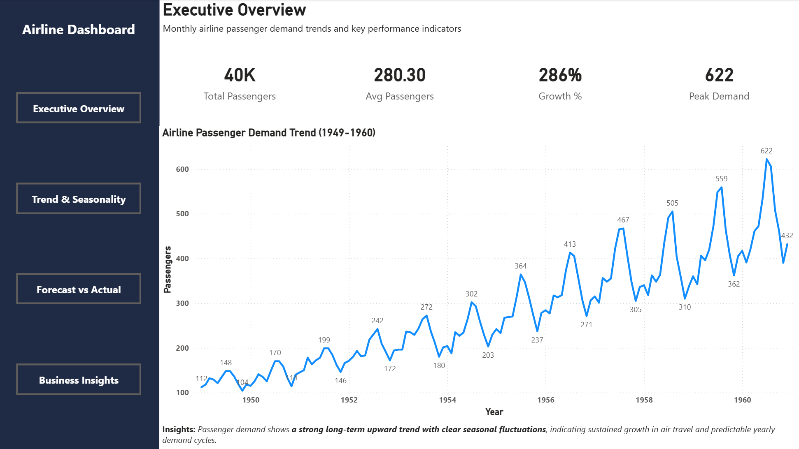
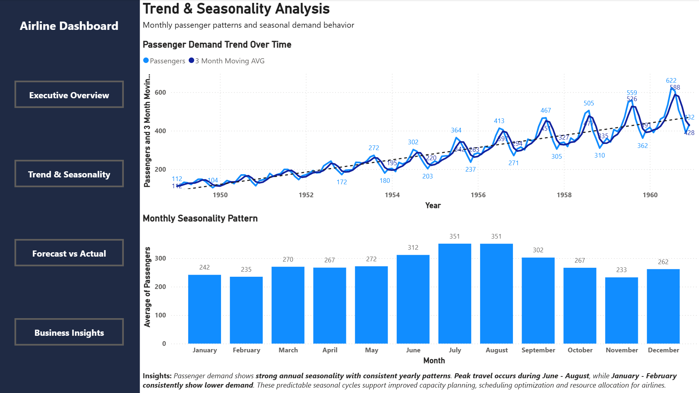
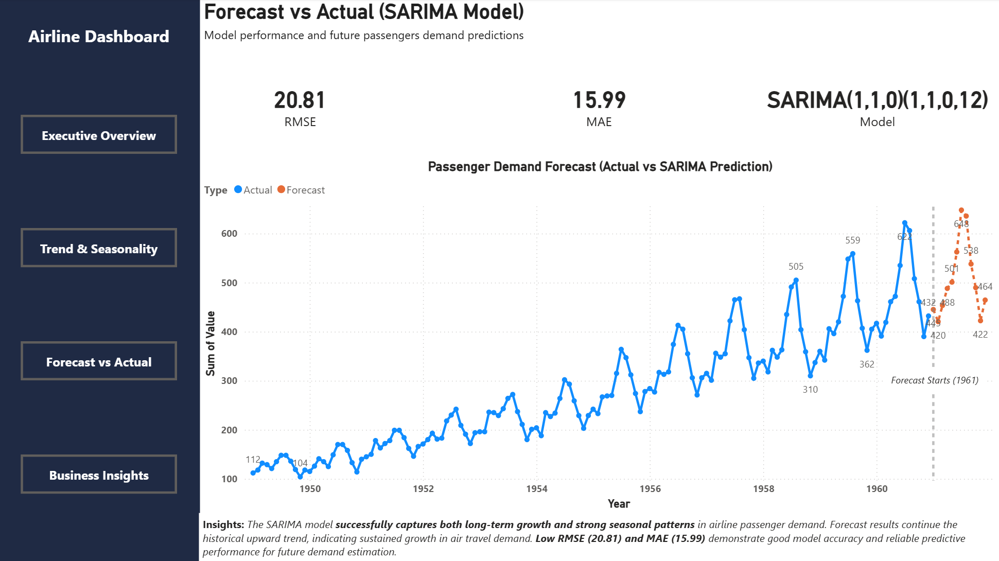
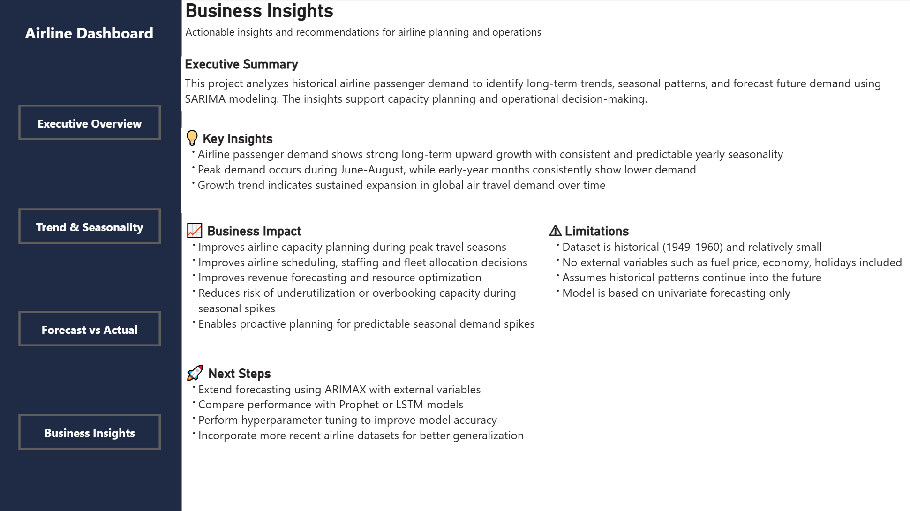

# **Airline Passenger Demand Forecasting: ARIMA vs SARIMA Analysis**
**Python & Power BI | Time Series Forecasting & Business Insights**

---

## **Project Overview**
This project analyzes **Airline Passenger dataset (1949–1960)** to understand long-term trends and seasonal patterns, and to build forecasting models for future demand prediction

Two models were developed:
- ARIMA (baseline model without seasonality)
- SARIMA (seasonal model capturing yearly patterns)

The objective is to determine which model provides more accurate and realistic forecasts for airline passenger demand based on historical data patterns.

Final insights are presented through a Power BI dashboard to support business decision-making in capacity planning and operations.

---

## **Problem Statement**
Airlines need accurate forecasts for passenger demand to optimize capacity, staffing, scheduling and marketing

This project explores whether ARIMA or SARIMA provides better forecasting performance for this dataset of airline passenger demand

---

## **Dataset**
- Source: https://www.kaggle.com/datasets/chirag19/air-passengers
- Time period: 1949-1960
- Key variables: Passengers (monthly time series)

---

## **Tools Used**
Python:
- pandas
- numpy
- matplotlib
- statsmodels
- sklearn
   
Power BI:
- Interactive dashboard
- KPI visuals
- Forecast visualization

---

## **Methodology**
- Data cleaning and preprocessing
- Exploratory time series analysis
- Feature engineering (trend & seasonality)
- Built ARIMA as baseline to capture trend-only structure
- Extended to SARIMA to incorporate seasonal patterns
- Model evaluation using Root Mean Squared Error (RMSE) and Mean Absolute Error (MAE)
- Forecast visualizations and comparison

---

## **Key Insights**

1. Passenger demand shows a **strong long-term upward trend**
2. Clear **seasonal fluctuations** with peak travel mid-year and lowest on Nov - Feb
3. SARIMA was selected as the **final model due to significantly lower error and its ability to capture seasonal demand patterns more accurately than ARIMA**
4. Forecasts show **continued proportional growth** in air travel demand throughout the years

---

## **Model Performance**
- **ARIMA: (1,1,0)** baseline model with no seasonality and AIC score of 1401.85
- **SARIMA: Final model (1,1,0)(1,1,0,12)** improved performance with seasonal component and AIC score of 1020.393
- Evaluation metrics:
  - **RMSE: 20.81 (3.35%)**
  - **MAE: 15.99 (2.57%)** 

---

## **Business Impact**

These insights are translated into operational recommendations for airline planning teams.

- Helps airlines **plan capacity** during peak travel seasons
- Optimize **staffing, scheduling decisions and resource allocation**
- Improves demand forecasting for **revenue planning**
- Prepare for **seasonal fluctuations in advance**
- Reduce risk of **over or under** capacity
  
---

## **Project Structure**

data_raw/

data_clean/

notebooks/

powerbi/

assets/

Organized project into modular folders for reproducibility and Power BI integration

---

## **Future Improvements**

- Include **external variables** to perform ARIMAX, such as GDP, festive seasons, promotions, fuel prices or travel demand factors
- Try other forecasting like **Prophet or LSTM (Long Short-Term Memory)**
- Perform **hyperparameter tuning** for SARIMA
- Expand dataset with more **recent** airline data

**Overall, the SARIMA model provides a reliable baseline forecasting approach for airline passenger demand and demonstrates the importance of incorporating seasonality in time series analysis**

---

## **Visuals**

Final results are visualized through a Power BI dashboard to support interactive exploration of trends and forecasts

### Executive Overview

### Trend & Seasonality

### Forecast vs Actual

### Business Insights

Click on the Power BI file in the `powerbi/` folder to explore the interactive dashboard.

